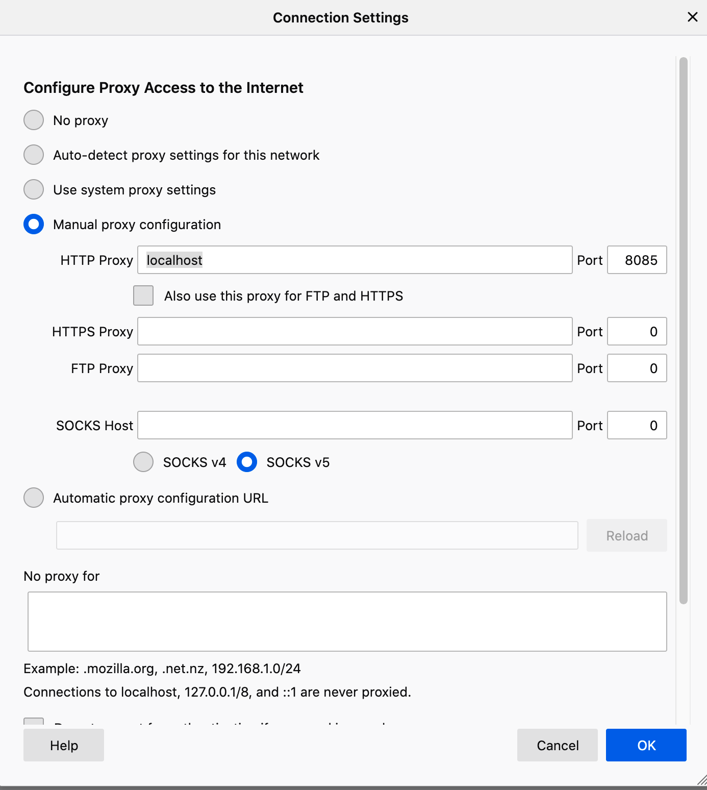

CLARIAH LDProxy - keep you LD URI's resolvable
=======

1. Compile and run:
```sh
mvn package
mkdir cached
rm *.txt && java -jar target/ldproxy.jar
```

2. Configure your browser's proxy, e.g. Firefox:


3. http://purl.org/dc/terms/abstract will now return the stored [DC terms RDF XML](src/resources/dc.xml) vased on this [example configuration](src/resources/ldproxy-config.xml). 

----
Based on https://github.com/stefano-lupo/Java-Proxy-Server